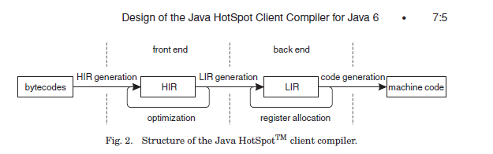

V8のJITコンパイラ、Crankshaftについて
###############################################################################

こんばんは、はじめまして。nothingcosmosと申します。

JavaScript Advent Calendar 2011 (オレ標準コース)
22日目の記事です。

JavaScript初心者ですので、お手柔らかにお願いします。

Crankshaftとは
================================================================================

Crankshaftというのは、JavaScriptエンジンであるV8に
ここ1年で新規追加された、JITコンパイラになります。

V8はこの新しいJITコンパイラの追加により、
V8ベンチマークで50%性能向上したようです。

.. image :: png/V8Bench.jpg

私は次に読むコンパイラはmozilla系のxxx monkeyにしようと思っていたのですが、

V8 Crankshaftの50%向上へ非常に興味を持ち、
最近になってさわり始めました。

公式Blogの紹介文
================================================================================
Crankshaftに関しては、以下の公式Blogで紹介されてました。

The Chromium Blog:A New Crankshaft for V8

http://blog.chromium.org/2010/12/new-crankshaft-for-v8.html

一部引用します ::

  Crankshaft has four main components:

  1. A base compiler which is used for all code initially. 
     The base compiler generates code quickly without heavy optimizations.
     Compilation with the base compiler is twice as fast as with the V8 compiler in Chrome 9 and generates 30% less code.

  2. A runtime profiler which monitors the running system and identifies hot code, 
     i.e., code that we spend a significant amount of the time running.

  3. An optimizing compiler which recompiles and optimizes hot code identified by the runtime profiler.
     It uses static single assignment form to perform optimizations such as loop-invariant code motion,
     linear-scan register allocation and inlining.
     The optimization decisions are based on type information collected while running the code produced by the base compiler.

  4. Deoptimization support which allows the optimizing compiler to be optimistic in the assumptions it makes when generating code.
     With deoptimization support, it is possible to bail out to the code generated by the base compiler
     if the assumptions in the optimized code turn out to be too optimistic.

この中で特に興味を引かれたのは、3と4です。
特殊なコンパイラ用語を簡単に説明すると、

static single assignment form(SSA形式)とは、
--------------------------------------------------------------------------------
  コンパイラ内部の中間表現のことです。

  最近のJITコンパイラは大体がSSA形式を採用しており、
  私が知っているのは、GCC、LLVM、JVM HotSpot C1/C2両方、AndroidICS、Crankshaft

  SSA形式用に考案された最適化アルゴリズムを使用して、
  短い時間で効率のよいコードへ変換することが期待できます。

  興味のある人はwikipediaを参照。

loop-invariant-code motionとは、
--------------------------------------------------------------------------------
  ループ中で不変な変数をループの外に追い出すコンパイラの最適化です。

  JVM HotSpot C1は行わないので、これは結構意外でした。

Linear-scan register allocationとは、
--------------------------------------------------------------------------------
  レジスタ割り付け用のアルゴリズムで、非常に高速に動作し、そこそこなコードを生成します。

  伝統的なコンパイラは、グラフ色彩のアルゴリズムを採用していますが、
  非常に時間がかかるアルゴリズムであるため、JITコンパイラではLinear-Scanが採用されることが多いです。

  Linear-scanの実装例を挙げると、LLVMとJVM HotSpot C1です。

Deoptimizationとは、
--------------------------------------------------------------------------------
  脱最適化と訳しますが、 JITコンパイルしたコードから、元の状態に戻す機能です。

  Crankshaftは、最初にコンパイルした汎用的なコードに戻すようです。

  JVM HotSpotは、JITコンパイルしたコードの途中から、インタプリタ実行に戻します。

  戻すにはランタイム側の協力が必要で、JITコンパイラ特有の機能になります。

type infomation correctとは、
--------------------------------------------------------------------------------
  型情報をランタイムプロファイラが取得することなのだと思います。

  JVM HotSpotでは、インタプリタ実行時にcast先の型や、instanceofの型や、invokevirtualした関数などを
  プロファイル情報として取得し、JITコンパイル時に活用します。

  さらにCrankshaftは型推論するとかなんとかいう噂を聞くため、プロファイル情報で型情報を取得しつつ、
  型推論との組み合わせで高速なコードを生成するのだと思います。

OnStackReplacementとは、
--------------------------------------------------------------------------------
  上記には挙げられていませんが、 実行中のコードから別のコードへ遷移する技術のことです。

  JVM HotSpotでは、ループの実行中に、
  このループを内包した関数はhot codeだなと判断した場合、 実行中の関数をJITコンパイルします。

  インタプリタで実行中だった場合、他関数の呼び出しを待たずに、
  現在実行中の関数の途中から、JITコンパイルしたコードへ移すことができます。

  CrankshaftもOSRを実装しているらしく、full-codegenで生成したコードの実行途中から、
  Crankshaftで生成したコードへ移すことができるのだと思います。

興味を持った点と疑問点
================================================================================

私はコードを読む前に、課題や疑問点、興味をもった点を設定して読むのですが、
以下のような点に疑問/興味を持ちました。

(1) A base compiler(full-codegen)が生成したコード
--------------------------------------------------------------------------------

  どんなコードを吐くのか。JavaScript初心者なので、どんな汎用的なコードに落ちるのか興味あります。

  V8は再帰関数がxxx monkeyと比較して速いという話を聞いたことがあったので、
  full-codegenが関数をstab越しに呼び出す際に何らかのトリックを使っていそう。

  hot codeを判断するため、runtimeと連携してprofileを取得する命令をfull-codegenは埋め込むはず。
  遅延を最小にする工夫と、どんなprofile情報を取得しているのか。

(2) Crankshaftが生成したコード
--------------------------------------------------------------------------------

  crankshaftは最も高速なコードを生成するはずで、どんなコードを吐くのか。

  deoptimizeが発生後、full-codegenへ戻るが、その後の挙動はどうなるのか。
  たとえば、full-codegenは再度プロファイル情報を取得しながらCrankshaftでのJITコンパイルの機会を伺うのか、
  同じ関数のCrankshaftでのJITコンパイルに上限を設けるのか。
  profile情報を落としてfull-codegenでコンパイルを行い、ずっとfull-codegenで実行するのか。

  inliningの仕組み。たとえば、JVMは呼び出し候補が複数ある場合、かつ第1候補が9割の確率で呼ばれる場合、
  第1候補をinliningする。CrankshaftがStabコードのまま扱うのか、inliningする条件が気になる。

  runtime profilerで型情報に関する情報を取得し、型推論した上でCrankshaftでJITコンパイルするはず。
  aggressiveに型推論した場合の保証コード+Trapの有無と、型推論の実装はどうなっているのか。

  型推論の結果をどのように適用するのか。ASTレベルなのかHIRレベルなのか。

  JVM HotSpot C1の生成したコードとどっちが速いか。

(3) hot codeのコンパイルの判断
--------------------------------------------------------------------------------

  最初にfull-codegenで生成したコードを実行し、hot codeだと判断したら、
  CrankshaftでJITコンパイルするはず。
  hot codeだと判断する条件は、しきい値以上に呼び出される関数であるかどうか、
  しきい値以上に実行されるループのどちらかのはず。

  hot codeであると判断する上で、runtime profilerとどのように連携するのかどうか。

(4) Crankshaftの中間表現とコンパイルパイプラインのデザインに関して
--------------------------------------------------------------------------------

  SSA形式といっても、色々あるので、どんな中間表現なのか。

  OSR/Deoptimizeの仕組み。 Tableの仕組みやSafecodeに関して。

  Profile情報の、JavaScript固有の活用方法

実行手順
================================================================================

上記を課題に、以下の手順でいろいろ試していました。

1. V8のダウンロード
-----------------------------------------------------------

  $ svn checkout http://v8.googlecode.com/svn/trunk/ v8-read-only

2. sconsのインストール
-----------------------------------------------------------

  私はubuntuだったので、パッケージマネージャでsconsを別途インストールしました。
  sconsは、makeの代替らしいです。

3. V8のビルド
-----------------------------------------------------------

  $ scons --help でビルドオプションが見れます。

  デバッグ版の場合、適当にオプションをまぜまぜしながら以下のように行いました。

  $ scons mode=debug sample=shell verbose=on disassembler=on

4. サンプルコード
-----------------------------------------------------------

FactIF ::

  function FactIf(n) {
    var p;
    if (n > 1) {
      p = n * FactIf(n - 1);
    } else {
      p = 1;
    }
    return p;
  }
  
  function Bench() {
    for (i=0; i<100000; i++) {
      ret = FactIf(i%100);
      print ('--- ' + i + ':'  + ret + '---');
    }
  }
  
  Bench();

5. 実行方法
-----------------------------------------------------------

  ビルドが成功すると、shell_gというバイナリができているはずです。

  $ shell_g fact_if.js

6. オプションの紹介
-----------------------------------------------------------

  $ shell_g --help とすると、それっぽいオプションの一覧が出来てます。

適当にオプションを紹介します。 ::

  --trace_hydrogen  カレントのhydornge.cfgにASTやら中間表現を出力する
  
  --trace_codegen   コンパイルログをstdoutに出力する
  
  --print_ast       コンパイル対象のjsのASTをstdoutに出力する
  
  --print_code      コンパイル後のAsmをstdoutに出力する

7. 実行例
-----------------------------------------------------------

  $ shell_g fact_if.js --trace_codegen

例) ::

  .
  Full Compiler - *** Generate code for builtin function: 0x40215aa5 <String[11]: Instantiate> ***
  Full Compiler - *** Generate code for builtin function: 0x40215abd <String[19]: InstantiateFunction> ***
  Crankshaft Compiler - *** Generate code for builtin function: 0x40215aa5 <String[11]: Instantiate> ***
  Full Compiler - *** Generate code for builtin function: 0x40215add <String[25]: ConfigureTemplateInstance> ***
  Full Compiler - *** Generate code for builtin function: 0x4020c375 <String[13]: DefaultNumber> ***
  Full Compiler - *** Generate code for builtin function: 0x402084f1 <String[7]: valueOf> ***
  Full Compiler - *** Generate code for builtin function: 0x4020c0e9 <String[8]: ToObject> ***
  Full Compiler - *** Generate code for builtin function: 0x4020c425 <String[11]: IsPrimitive> ***
  Full Compiler - *** Generate code for builtin function: 0x402084c9 <String[8]: toString> ***
  Full Compiler - *** Generate code for builtin function: 0x4020e419 <String[20]: FunctionSourceString> ***
  Full Compiler - *** Generate code for user-defined function: 0x40208309 <String[0]: > ***
  Full Compiler - *** Generate code for user-defined function: 0x402187fd <String[5]: Bench> ***
  Full Compiler - *** Generate code for user-defined function: 0x402187d9 <String[6]: FactIf> ***
  --- 0:1---
  --- 1:1---
  --- 2:2---
  .
  --- 233:8.683317618811886e+36---
  --- 234:2.9523279903960412e+38---
  Crankshaft Compiler - *** Generate code for user-defined function: 0x402187fd <String[5]: Bench> ***
  --- 235:1.0333147966386144e+40---
  --- 236:3.719933267899012e+41---
  .
  --- 383:3.945523969720657e+124---
  --- 384:3.314240134565352e+126---
  Crankshaft Compiler - *** Generate code for user-defined function: 0x402187d9 <String[6]: FactIf> ***
  --- 385:2.8171041143805494e+128---
  --- 386:2.4227095383672724e+130---

上記ログによると、最初に起動に必要なjsをfull-codegenでコンパイルし、

hot codeをCrankshaftでrecompileしているようです。

CrankshaftでRecompileされているメソッドは、Bench()とFactIf()です。

Bench()

  ループ長が長いため、hot codeだと判定され、CrankshaftでRecompileされているのだと思います。

  Bench()をRecompileした際には、ログの出力からBench()を実行中なはずです。

  FactIf()のreturnからBench()のCrankshaftが生成したコードへ遷移しているか、

  Crankshaftが生成したコードのループの中にsafepointを埋め込み、

  full-codegenのsafepointからCrankshaftが生成したコードへ遷移しているはずです。

FactIF()

  何度も呼び出されるメソッドであるため、hot codeだと判定され、CrankshaftでRecompileされているのだと思います。

  何度も呼び出されるメソッドの場合、メソッドが次に呼ばれた際に、

  full-codegenが生成したコードではなく、Crankshaftが生成したコードを呼び出せば良いはずです。

8. gdb debug
-----------------------------------------------------------

gdbでbreakできます ::

  $ gdb shell_g

  (gdb) break v8::internal::MakeCrankshaftCode(v8::internal::CompilationInfo*) 
  Breakpoint 1 at 0x8092328: file src/compiler.cc, line 173.
  (gdb) run sample/fact_if.js
  Starting program: /home/elise/language/V8/v8/shell_g sample/fact_if.js
  [Thread debugging using libthread_db enabled]
  [New Thread 0xb7fe2b70 (LWP 13542)]
  
  Breakpoint 1, v8::internal::MakeCrankshaftCode (info=0xbfffe5c8) at src/compiler.cc:173
  173   if (!info->AllowOptimize()) {
  (gdb) 

Crankshaftの内部
================================================================================

Crankshaftの入り口は、MakeCrankshaftCode() ::

  Handle<Context> global_context(info->closure()->context()->global_context());
  TypeFeedbackOracle oracle(code, global_context, info->isolate());    <-- Hydrogenの型情報や推論結果をASTへフィードバックする？
  HGraphBuilder builder(info, &oracle);
  HPhase phase(HPhase::kTotal);
  HGraph* graph = builder.CreateGraph();                               <-- high-level

  if (graph != NULL && FLAG_build_lithium) {
    Handle<Code> optimized_code = graph->Compile(info);                <-- low-level
    if (!optimized_code.is_null()) {
      info->SetCode(optimized_code);
      FinishOptimization(info->closure(), start);
      return true;
    }
  }

Crankshaftには、high-level(HIR)な中間表現であるhydrogenと、
low-level(LIR)な中間表現であるlithiumがあります。

hydrogenはSSA形式の中間表現で、builder.CreateGraph()で機種非依存の最適化を行います。

lithiumは3つ組形式の、機種依存の中間表現で、

mips arm x86/x64向けが用意されており、それぞれのディレクトリ下で定義されています。

graph->Compile()ではhydrogenから機種依存のlithiumへ変換された後、

機種依存の最適化、レジスタ割り付け、コード生成を行います。

レジスタ割り付けなどの機種共通の処理では、

lithiumのベースクラスから継承したvirtual method経由でレジスタ割り付け等を行うはずです。

上記の構造は、JVM HotSpot Clientコンパイラと非常によく似ています。

builder.CreateGraph()
================================================================================

CreateGraph()は、JavaScriptのASTからgraphベースのhydrogenへの変換、最適化まで行います。

Hydrogenの大まかな流れ ::

  //graph_の生成
  graph_ = HGraph(info())
  
  current_block_ = graph()->entry_block();
  
  HBasicBlock* body_entry = CreateBasicBlock(initial_env);
  current_block()->Goto(body_entry);
  
  VisitDeclarations();
  AddSimulate();
  VisitStatements();
  
  graph()->OrderBlocks();
  graph()->AssignDominators();
  
  graph()->PropagateDeoptimizingMark();
  graph()->EliminateRedundantPhis();
  graph()->EliminateUnreachablePhis();
  graph()->CollectPhis();
  
  HInferRepresentation rep(graph());
  rep.Analyze()
  
  graph()->MarkDeoptimizeOnUndefined();
  graph()->InsertRepresentationChanges();

  graph()->InitializeInferredTypes();       <-- 型推論
  graph()->Canonicalize();                  <-- 確定した型情報を参照し、冗長な型チェックを除去する

  HGlobalValueNumberer gvn()       <-- GVN
  gvn.Analyze()
    LoopInvariantCodeMotion()      <-- LICM
    AnalyzeBlock()

  HRangeAnalysis rangeAnalysis(graph());
  rangeAnalysis.Analyze();

  graph()->ComputeMinusZeroChecks();

  HStackCheckLiminator sce(graph());
  sce.Process();

  graph()->ReplacedCheckedValues();

HGraph::Compile()
================================================================================

Compile()は、hydrogenからlithiumへの変換、機種依存の最適化およびコード生成まで行う

lithiumの大まかな流れ ::

  LAllocator allocator();
  LChunkBuilder builder(info, this, &allocator);
  LChunk* chunk = builder.Build();
  
  allocator.Allocate(chunk);
  
  MacroAssembler assembler(info ...);
  LCodeGen generator(chunk, &assembler, info);
  
  generator.Generatecode();
  CodeGenerator::MarkCodePrologu(info);
  code = CodeGenerator::MarkCodeEpilogue(&assembler, flags, info);
  generator.FinishCode(code)
  CodeGenerator::PrintCode(code, info);

AST Image
================================================================================

FactIf AST ::

  *** Generate code for user-defined function: 0x53717ff5 <String[6]: FactIf> ***
  --- AST ---
  FUNC
  . NAME "FactIf"
  . INFERRED NAME ""
  . PARAMS
  . . VAR (mode = VAR) "n"
  . DECLS
  . . VAR (mode = VAR) "p"
  . BLOCK INIT
  . IF
  . . GT
  . . . VAR PROXY parameter[0] (mode = VAR) "n"
  . . . LITERAL 1
  . THEN
  . . BLOCK
  . . . ASSIGN
  . . . . VAR PROXY local[0] (mode = VAR) "p"
  . . . . MUL
  . . . . . VAR PROXY parameter[0] (mode = VAR) "n"
  . . . . . CALL
  . . . . . . VAR PROXY (mode = DYNAMIC_GLOBAL) "FactIf"
  . . . . . . SUB
  . . . . . . . VAR PROXY parameter[0] (mode = VAR) "n"
  . . . . . . . LITERAL 1
  . ELSE
  . . BLOCK
  . . . ASSIGN
  . . . . VAR PROXY local[0] (mode = VAR) "p"
  . . . . LITERAL 1
  . RETURN
  . . VAR PROXY local[0] (mode = VAR) "p"

hydrogen image
================================================================================

FactIf hydrogen ::

  begin_compilation
    name "FactIf"
    method "FactIf"
    date 1324387693000
  end_compilation

.. graphviz::

  digraph factIf {

  B0 [shape=box, label="B0:\l 0 0 v0 BlockEntry  <|@ \l 0 1 t1 Constant 0x32e08091 <undefined> <|@ \l 0 1 t2 Parameter 0 <|@ \l 0 4 t3 Parameter 1 <|@ \l 0 5 t4 Context  <|@ \l 0 0 v5 Simulate id=2 var[0] = t2, var[1] = t3, var[2] = t4, var[3] = t1 <|@ \l 0 0 v6 Goto B1 <|@ \l "];
  B0 -> B1;

  B1 [shape=box, label="B1:\l 0 0 v7 BlockEntry  <|@ \l 0 0 v8 Simulate id=3 <|@ \l 0 0 v9 StackCheck  <|@ \l 0 2 i42 Change t3 t to i range[-2147483648,2147483647,m0=0] <|@ \l 0 2 i43 Constant 1 range[1,1,m0=0] <|@ \l 0 0 v11 CompareIDAndBranch GT i42 i43 goto (B4, B2) <|@ \l "];
  B1 -> B4;
  B1 -> B2;

  B2 [shape=box, label="B2:\l 0 0 v15 BlockEntry  <|@ \l 0 0 v16 Simulate id=47 <|@ \l 0 0 v17 Goto B3 <|@ \l "];
  B2 -> B3;

  B3 [shape=box, label="B3:\l 0 0 v30 BlockEntry  <|@ \l 0 2 t31 Constant 1 range[1,1,m0=0] type[smi] <|@ \l 0 0 v34 Simulate id=45 var[3] = t31 <|@ \l 0 0 v35 Goto B6 <|@ \l "];
  B3 -> B6;

  B4 [shape=box, label="B4:\l 0 0 v12 BlockEntry  <|@ \l 0 0 v13 Simulate id=46 <|@ \l 0 0 v14 Goto B5 <|@ \l "];
  B4 -> B5;

  B5 [shape=box, label="B5:\l 0 0 v18 BlockEntry  <|@ \l 0 1 t19 GlobalObject t4 <|@ \l 0 1 i21 Sub i42 i43 range[1,2147483646,m0=0] <|@ \l 0 1 t22 LoadGlobalCell [0x471090d1] <|@ \l 0 0 t23 CheckFunction t22 0x32e41645 <|@ \l 0 1 t24 GlobalReceiver t19 <|@ \l 0 0 t25 PushArgument t24 <|@ \l 0 1 t45 Change i21 i to t range[1,2147483646,m0=0] type[number] <|@ \l 0 0 t26 PushArgument t45 <|@ \l 0 2 t27 CallKnownGlobal o #2 changes[*] <|@ \l 0 0 v28 Simulate id=28 push t3, push t27 <|@ \l 0 1 d40 Change t3 t to d <|@ \l 0 1 d46 Change t27 t to d <|@ \l 0 2 d29 Mul d40 d46 ! <|@ \l 0 0 v32 Simulate id=45 pop 2 / var[3] = d29 <|@ \l 0 1 t47 Change d29 d to t type[heap-number] <|@ \l 0 0 v33 Goto B6 <|@ \l "];
  B5 -> B6;

  B6 [shape=box, label="B6:\l 0 0 v37 BlockEntry  <|@ \l 0 0 v38 Return t36 <|@ \l "];

  B6_locals [shape=box, label="B6_locals: \l predecessors B5, B3 \l 3 t36 [ t47  t31  uses1_0i_0d_1t_live] \l "];
  B6_locals -> B6;
  }

PHIの存在
--------------------------------------------------------------------------------

  B6_localsがPHIを表現していて、

  B5から来た場合は、t36はt47と等しく、B3から来た場合は、t36はt31と等しい。

  t36は、B6でReturn t36される。 つまりt36はvar pを指す。

  PHIがBlock中のIRとして表現されていない点、

  またHydrogenがgraph baseということらしいので、

  JVM HotSpot C1 のHIRより、JVM HotSpot C2 のIdeal IRに近いのかもしれません。

lithium image
================================================================================

FactIf lithium::

  begin_compilation
    name "FactIf"
    method "FactIf"
    date 1324387693000
  end_compilation

.. graphviz::

  digraph factIf {

  B0 [shape=box, label="B0:\l 0 label () () () ()  <|@ \l 2 gap () () () ()  <|@ \l 4 parameter [stack:-2]=  <|@ \l 6 gap () ([stack:-2];) () ()  <|@ \l 8 parameter [stack:-1]=  <|@ \l 10 gap () ([stack:-1];) () ()  <|@ \l 12 context [eax|R]=  <|@ \l 14 gap ([stack:0] = [eax|R];) () () ()  <|@ \l 16 gap () () () ()  <|@ \l 18 goto B1 <|@ \l "];
  B0 -> B1;

  B1 [shape=box, label="B1:\l 20 label () () () ()  <|@ \l 22 gap () ([esi|R] = [eax|R];) () ()  <|@ \l 24 stack-check = [esi|R] [id=3|[parameters=2|[arguments_stack_height=0|[stack:-2];[stack:-1];[constant:1]] {[esi|R];[stack:0];[eax|R]} @-1 <|@ \l 26 gap () ([eax|R] = [stack:-1];) () ()  <|@ \l 28 tagged-to-i [eax|R]= [eax|R] [id=3|[parameters=2|[arguments_stack_height=0|[stack:-2];[stack:-1];[constant:1]] <|@ \l 30 gap (v0(0) = [eax|R];) () () ()  <|@ \l 32 gap () () () ()  <|@ \l 34 cmp-id-and-branch if [eax|R] > [constant:43] then B4 else B2 <|@  \l "];
  B1 -> B4;
  B1 -> B2;

  B2 [shape=box, label="B2:\l 36 label () () () ()  Dead block replaced with B3 <|@ \l 38 gap () () () ()  <|@ \l 40 gap () () () ()  <|@ \l 42 goto B3 <|@ \l "];
  B2 -> B3;

  B3 [shape=box, label="B3:\l 44 label () () () ()  <|@ \l 46 gap () () () ()  <|@ \l 48 gap () ([ecx|R] = [constant:31];) () ()  <|@ \l 50 goto B6 <|@ \l "];
  B3 -> B6;

  B4 [shape=box, label="B4:\l 52 label () () () ()  Dead block replaced with B5 <|@ \l 54 gap () () () ()  <|@ \l 56 gap () () () ()  <|@ \l 58 goto B5 <|@ \l "];
  B4 -> B5;

  B5 [shape=box, label="B5:\l 60 label () () () ()  <|@ \l 62 gap () () ([ecx|R] = [stack:0];) ()  <|@ \l 64 global-object [ecx|R]= [ecx|R] <|@ \l 66 gap (v0(0) = [ecx|R];) ([eax|R];) () ()  <|@ \l 68 sub-i [eax|R]= [eax|R] [constant:43] <|@ \l 70 gap (v0(0) = [eax|R];) () () ()  <|@ \l 72 load-global-cell [edx|R]=  <|@ \l 74 gap (v0(0) = [edx|R];) () () ()  <|@ \l 76 check-function = [edx|R] [id=46|[parameters=2|[arguments_stack_height=0|[stack:-2];[stack:-1];[constant:1]] <|@ \l 78 gap () () () ()  <|@ \l 80 global-receiver [ecx|R]= [ecx|R] <|@ \l 82 gap (v0(0) = [ecx|R];) () () ()  <|@ \l 84 push-argument = [ecx|R] <|@ \l 86 gap () ([eax|R];) () ()  <|@ \l 88 number-tag-i [eax|R]= [eax|R] [id=46|[parameters=2|[arguments_stack_height=1|[stack:-2];[stack:-1];[constant:1]] {[eax|R]} @66 <|@ \l 90 gap (v0(0) = [eax|R];) () () ()  <|@ \l 92 push-argument = [eax|R] <|@ \l 94 gap () () () ()  <|@ \l 96 call-known-global [eax|R]#1 /  {} @57 <|@ \l 98 gap (v0(0) = [eax|R];) ([eax|R];) () ()  <|@ \l 100 lazy-bailout =  [id=28|[parameters=2|[arguments_stack_height=0|[stack:-2];[stack:-1];[constant:1];[stack:-1];[eax|R]] <|@ \l 102 gap () () ([ecx|R] = [stack:-1];) ()  <|@ \l 104 double-untag [xmm1|R]= [ecx|R] [id=28|[parameters=2|[arguments_stack_height=0|[stack:-2];[ecx|R];[constant:1];[ecx|R];[eax|R]] <|@ \l 106 gap (v0(0) = [xmm1|R];) () () ()  <|@ \l 108 double-untag [xmm2|R]= [eax|R] [id=28|[parameters=2|[arguments_stack_height=0|[stack:-2];[ecx|R];[constant:1];[ecx|R];[eax|R]] <|@ \l 110 gap (v0(0) = [xmm2|R];) ([xmm1|R];) () ()  <|@ \l 112 mul-d [xmm1|R]= [xmm1|R] [xmm2|R] <|@ \l 114 gap (v0(0) = [xmm1|R];) () () ()  <|@ \l 116 number-tag-d [ecx|R]= [xmm1|R] {} @55 <|@ \l 118 gap (v0(0) = [ecx|R];) () () ()  <|@ \l 120 gap () ([ecx|R];) () ()  <|@ \l 122 goto B6 <|@ \l "];
  B5 -> B6;

  B6 [shape=box, label="B6:\l 124 label () (v0(0) = [ecx|R];) () ()  <|@ \l 126 gap () ([eax|R] = [ecx|R];) () ()  <|@ \l 128 return = [eax|R] <|@ \l 130 gap () () () ()  <|@ \l "];
  }

Crankshaft generate code
================================================================================

入力ソース ::

  --- Raw source ---
  (n) {
    var p;
    if (n > 1) {
      p = n * FactIf(n - 1);
    } else {
      p = 1;
    }
    return p;
  }

x86 generated code ::

  --- Optimized code ---
  kind = OPTIMIZED_FUNCTION
  name = FactIf
  stack_slots = 1
  Instructions (size = 512)
  0x29027a00     0  55             push ebp
  0x29027a01     1  89e5           mov ebp,esp
  0x29027a03     3  56             push esi
  0x29027a04     4  57             push edi
  0x29027a05     5  83ec04         sub esp,0x4
  0x29027a08     8  8b45fc         mov eax,[ebp+0xfc]
  0x29027a0b    11  8945f4         mov [ebp+0xf4],eax
  0x29027a0e    14  89c6           mov esi,eax
  0x29027a10    16  3b258c182109   cmp esp,[0x921188c]
  0x29027a16    22  7305           jnc 29  (0x29027a1d)
  0x29027a18    24  e8a38cfeff     call 0x290106c0             ;; code: STUB, StackCheckStub, minor: 0
  0x29027a1d    29  8b4508         mov eax,[ebp+0x8]
  0x29027a20    32  a801           test al,0x1
  0x29027a22    34  0f85f4000000   jnz 284  (0x29027b1c)
  0x29027a28    40  d1f8           sar eax,1
  0x29027a2a    42  83f801         cmp eax,0x1                 <-- if (n>1) goto 61
  0x29027a2d    45  0f8f0a000000   jg 61  (0x29027a3d)
  0x29027a33    51  b902000000     mov ecx,0x2
  0x29027a38    56  e9d7000000     jmp 276  (0x29027b14)       <-- if !(n>1) goto 276
  0x29027a3d    61  8b4df4         mov ecx,[ebp+0xf4]          <-- // 以降が p = n * FactIf(n-1);に該当する
  0x29027a40    64  8b4913         mov ecx,[ecx+0x13]
  0x29027a43    67  83e801         sub eax,0x1                 <-- eax = n - 1
  0x29027a46    70  8b15d490e023   mov edx,[0x23e090d4]        ;; global property cell  // 呼び出すproperty callのチェック
  0x29027a4c    76  81fad11b9446   cmp edx,0x46941bd1          ;; object: 0x46941bd1 <JS Function FactIf> <--想定するFactIf
  0x29027a52    82  0f853206de20   jnz 0x49e0808a              ;; deoptimization bailout 1 //想定するcallでない場合、bailout
  0x29027a58    88  8b4913         mov ecx,[ecx+0x13]          <-- 隠れ引数。thisポインタでも設定してるんでしょうかね？
  0x29027a5b    91  fff1           push ecx
  0x29027a5d    93  03c0           add eax,eax
  0x29027a5f    95  0f80e6000000   jo 331  (0x29027b4b)        <-- まさかのオーバーフローチェック。
  0x29027a65   101  fff0           push eax                    <-- argument set n
  0x29027a67   103  bfd11b9446     mov edi,0x46941bd1          ;; object: 0x46941bd1 <JS Function FactIf> <--想定するFactIf
  0x29027a6c   108  8b75fc         mov esi,[ebp+0xfc]
  0x29027a6f   111  c6c102         mov_b cl,0x2
  0x29027a72   114  e889ffffff     call 0  (0x29027a00)        ;; debug: position 57
                                                               ;; code: OPTIMIZED_FUNCTION <-- たぶんここがFactIf()
  0x29027a77   119  8b4d08         mov ecx,[ebp+0x8]
  0x29027a7a   122  f6c101         test_b cl,0x1
  0x29027a7d   125  7426           jz 165  (0x29027aa5)
  0x29027a7f   127  8179ff2181b040 cmp [ecx+0xff],0x40b08121    ;; object: 0x40b08121 <Map(elements=1)>
  0x29027a86   134  7416           jz 158  (0x29027a9e)
  0x29027a88   136  81f991809046   cmp ecx,0x46908091          ;; object: 0x46908091 <undefined>
  0x29027a8e   142  0f850a06de20   jnz 0x49e0809e              ;; deoptimization bailout 3
  0x29027a94   148  f20f100d103d4608 movsd xmm1,[0x8463d10]
  0x29027a9c   156  eb0f           jmp 173  (0x29027aad)
  0x29027a9e   158  f20f104903     movsd xmm1,[ecx+0x3]        <-- load n
  0x29027aa3   163  eb08           jmp 173  (0x29027aad)
  0x29027aa5   165  d1f9           sar ecx,1
  0x29027aa7   167  f20f2ac9       cvtsi2sd xmm1,ecx
  0x29027aab   171  03c9           add ecx,ecx
  0x29027aad   173  a801           test al,0x1
  0x29027aaf   175  7425           jz 214  (0x29027ad6)
  0x29027ab1   177  8178ff2181b040 cmp [eax+0xff],0x40b08121    ;; object: 0x40b08121 <Map(elements=1)>
  0x29027ab8   184  7415           jz 207  (0x29027acf)
  0x29027aba   186  3d91809046     cmp eax, 0x46908091         ;; object: 0x46908091 <undefined>
  0x29027abf   191  0f85e305de20   jnz 0x49e080a8              ;; deoptimization bailout 4
  0x29027ac5   197  f20f1015103d4608 movsd xmm2,[0x8463d10]
  0x29027acd   205  eb0f           jmp 222  (0x29027ade)
  0x29027acf   207  f20f105003     movsd xmm2,[eax+0x3]
  0x29027ad4   212  eb08           jmp 222  (0x29027ade)
  0x29027ad6   214  d1f8           sar eax,1
  0x29027ad8   216  f20f2ad0       cvtsi2sd xmm2,eax
  0x29027adc   220  03c0           add eax,eax
  0x29027ade   222  f20f59ca       mulsd xmm1,xmm2             <-- n * FactIf(n-1);
  0x29027ae2   226  8b0d94122109   mov ecx,[0x9211294]
  0x29027ae8   232  89c8           mov eax,ecx
  0x29027aea   234  83c00c         add eax,0xc
  0x29027aed   237  0f82b9000000   jc 428  (0x29027bac)
  0x29027af3   243  3b0598122109   cmp eax,[0x9211298]
  0x29027af9   249  0f87ad000000   ja 428  (0x29027bac)
  0x29027aff   255  890594122109   mov [0x9211294],eax
  0x29027b05   261  83c101         add ecx,0x1
  0x29027b08   264  c741ff2181b040 mov [ecx+0xff],0x40b08121    ;; object: 0x40b08121 <Map(elements=1)>
  0x29027b0f   271  f20f114903     movsd [ecx+0x3],xmm1
  0x29027b14   276  89c8           mov eax,ecx                 <-- if (n<=0)の場合はここに飛んでくる ecx = 0x2
  0x29027b16   278  89ec           mov esp,ebp
  0x29027b18   280  5d             pop ebp
  0x29027b19   281  c20800         ret 0x8                     <-- return p
  0x29027b1c   284  8178ff2181b040 cmp [eax+0xff],0x40b08121    ;; object: 0x40b08121 <Map(elements=1)>
  0x29027b23   291  0f858905de20   jnz 0x49e080b2              ;; deoptimization bailout 5
  0x29027b29   297  f20f104003     movsd xmm0,[eax+0x3]
  0x29027b2e   302  f20f2cc0       cvttsd2si eax,xmm0
  0x29027b32   306  f20f2ac8       cvtsi2sd xmm1,eax
  0x29027b36   310  660f2ec1       ucomisd xmm0,xmm1
  0x29027b3a   314  0f857205de20   jnz 0x49e080b2              ;; deoptimization bailout 5
  0x29027b40   320  0f8a6c05de20   jpe 0x49e080b2              ;; deoptimization bailout 5
  0x29027b46   326  e9dffeffff     jmp 42  (0x29027a2a)
  0x29027b4b   331  60             pushad                      <-- overflowした場合はここに飛んでくる
  0x29027b4c   332  d1f8           sar eax,1
  0x29027b4e   334  3500000080     xor eax, 0x80000000
  0x29027b53   339  f20f2ac0       cvtsi2sd xmm0,eax
  0x29027b57   343  8b0594122109   mov eax,[0x9211294]
  0x29027b5d   349  89c1           mov ecx,eax
  0x29027b5f   351  83c10c         add ecx,0xc
  0x29027b62   354  0f821e000000   jc 390  (0x29027b86)
  0x29027b68   360  3b0d98122109   cmp ecx,[0x9211298]
  0x29027b6e   366  0f8712000000   ja 390  (0x29027b86)
  0x29027b74   372  890d94122109   mov [0x9211294],ecx
  0x29027b7a   378  83c001         add eax,0x1
  0x29027b7d   381  c740ff2181b040 mov [eax+0xff],0x40b08121    ;; object: 0x40b08121 <Map(elements=1)>
  0x29027b84   388  eb17           jmp 413  (0x29027b9d)
  0x29027b86   390  c744241c00000000 mov [esp+0x1c],0x0
  0x29027b8e   398  8b75fc         mov esi,[ebp+0xfc]
  0x29027b91   401  33c0           xor eax,eax
  0x29027b93   403  bbfa8c2b08     mov ebx,0x82b8cfa
  0x29027b98   408  e8030effff     call 0x290189a0             ;; code: STUB, CEntryStub, minor: 1
  0x29027b9d   413  f20f114003     movsd [eax+0x3],xmm0
  0x29027ba2   418  8944241c       mov [esp+0x1c],eax
  0x29027ba6   422  61             popad
  0x29027ba7   423  e9b9feffff     jmp 101  (0x29027a65)
  0x29027bac   428  33c9           xor ecx,ecx
  0x29027bae   430  60             pushad
  0x29027baf   431  8b75fc         mov esi,[ebp+0xfc]
  0x29027bb2   434  33c0           xor eax,eax
  0x29027bb4   436  bbfa8c2b08     mov ebx,0x82b8cfa
  0x29027bb9   441  e8e20dffff     call 0x290189a0             ;; code: STUB, CEntryStub, minor: 1
  0x29027bbe   446  89442418       mov [esp+0x18],eax
  0x29027bc2   450  61             popad
  0x29027bc3   451  e947ffffff     jmp 271  (0x29027b0f)
  0x29027bc8   456  90             nop
  0x29027bc9   457  90             nop
  0x29027bca   458  90             nop
  0x29027bcb   459  90             nop
  0x29027bcc   460  90             nop
  0x29027bcd   461  0f1f00         nop

  Deoptimization Input Data (deopt points = 6)
   index  ast id    argc     pc             
       0       3       0     29
       1      46       0     -1
       2      28       0    119
       3      28       0     -1
       4      28       0     -1
       5       3       0     -1
  
  Safepoints (size = 48)
  0x29027a1d    29  1 (sp -> fp)       0
  0x29027a77   119  0 (sp -> fp)       2
  0x29027b9d   413  0 | eax (sp -> fp)  <none>
  0x29027bbe   446  0 (sp -> fp)  <none>

まとめ
================================================================================

FactIfを呼び出す前に、global propertyからFactIf(var n)を取り出して、

FactIf(int n)か判定してるというイメージで良いのでしょうか。

引数の型ごとにFactIfのバージョンを作ってるのかなーと勝手に想像しています。

他にも色々なチェック処理が前後で入っていますね。

チェック処理がJavaScript依存であり、除去が難しいのであれば、

Dartでは除去できるように設計されているかもしれません。

CrankshaftとJVM HotSpot C1
--------------------------------------------------------------------------------

Crankshaftの内部構造に関しては、下記のBlogが非常に詳しいです。

wingolog
http://wingolog.org/tags/v8

上記ブログによると、CrankshaftがJVM HotSpot C1のパクリというか、インスパイアしているらしいです。

C1というより、C1.3くらいですが。

CrankshaftがJVM HotSpot C1から様々な技術を取り入れ、高速化されているように思いました。

※  wikipediaによると、HotSpotの人がリーダーらしいです。

xxx monkeyはJavaと同等の速度を目指すらしいのですが、

Crankshaftを見習ってJVM HotSpot C1/C2から取り入れるのであれば、

現実的な目標のようの思いました。

JVM HotSpotと比較すれば、CrankshaftもJITコンパイルの改良によって性能向上できる余地は残っているように思います。

参考までに、以前作った OpenJDKのHotSpot C1の資料です。

http://nothingcosmos.github.com/OpenJDKOverview/

V8とV8ベンチマーク
--------------------------------------------------------------------------------

V8とセットのV8ベンチマークの提供は、V8の方向性を示しており非常に面白いと思っています。

V8ベンチマークは再帰が多いため、xxx monkeyと比較してV8に有利だという話もありますが、

どのような最適化を実装するか否かの判断は、ターゲットにしているベンチマークに依存するはずです。

ループを多用したベンチマークの性能を上げたければ、

Crankshaftにヘビーなループ最適化を導入すればよいのに、現状はそうなっていない。

V8ベンチマークが、V8の性能向上の指針として非常に重要なのだと思います。

※  他のベンチマーク結果も参考にしていると思いますが、詳しいことはよくわかりません。

